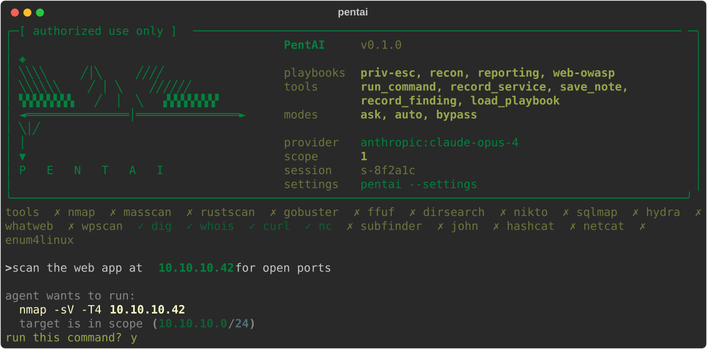

# PentAI

[](LICENSE)
[](pyproject.toml)
[](#contributing)

A terminal AI agent that helps you learn ethical hacking by planning and running commands with you, one confirmed step at a time.



## Ethical use

PentAI is built for authorized security testing and hands-on learning only: use it against systems you own or have explicit written permission to test (your own lab, a CTF, a client engagement with signed scope). PentAI is open source and dual-use software - it does not know or enforce what you are authorized to touch. You are solely responsible for how you use it and for complying with the law in your jurisdiction. The built-in scope list and confirmation prompts are safety rails, not a substitute for authorization.

## Install

Requires Python 3.11+.

```bash
git clone https://github.com/Ian-XG/PentAI.git
cd PentAI
pip install -e ".[dev]"
```

## Run

```bash
pentai
```

If no provider is configured yet (no `~/.pentai/config.yaml` and no API key in the environment), PentAI walks you through a short interactive setup wizard on first launch - pick a provider, paste a key, done.

This drops you into a full-screen terminal UI: a scrolling output pane, an input line, and a status bar (`mode:BYPASS  scope:0  cmds:0  ...`). Type natural language and the agent will plan and (with your confirmation) run shell commands. Type `/help` to see available commands, `shift+tab` to cycle permission mode, `esc` to stop a running turn, `/quit` to exit.

```bash
pentai --classic     # plain scrolling REPL (root@pentai:~# prompt) instead of the full-screen UI
pentai --classic --no-fx   # classic mode without the boot animation
pentai --settings    # re-run the provider/model/key setup wizard
pentai update        # check for a newer version and install it (see Updates below)
pentai -c            # resume the most recent engagement
pentai --resume <id> # resume a specific engagement (see /sessions for ids)
```

## Provider setup

PentAI is BYOK (bring your own key) and works with:

- **Anthropic** (native Messages API) - set `ANTHROPIC_API_KEY`
- **Any OpenAI-compatible endpoint** - OpenAI itself, Ollama, Groq, OpenRouter, etc. - set `OPENAI_API_KEY` (or a custom env var, see below)

```bash
export ANTHROPIC_API_KEY=sk-ant-...
export OPENAI_API_KEY=sk-...
pentai
```

On startup, PentAI reads `~/.pentai/config.yaml` if it exists. If the file is missing (or empty) and no key is set in the environment, it launches the setup wizard; otherwise it falls back to built-in defaults: an `anthropic` provider (`claude-opus-4`) and an `openai` provider (`gpt-4o` against the official OpenAI API), each reading its matching API key from the environment automatically.

Some models over-refuse legitimate offensive-security requests. Run `/models` inside PentAI for a short list of low-refusal models known to work well for pentesting/CTF work, and `/model` to see the active provider's available models and switch with `/model <number>` (no need to type the full model name, no re-entering your key).

To use another provider (Ollama, Groq, OpenRouter, or any other OpenAI-compatible backend), copy `pentai/config.example.yaml` to `~/.pentai/config.yaml` and edit it. `config.example.yaml` documents the full config schema used by `pentai.config.load_config` / `Config` / `ProviderConfig`, including how to point at other OpenAI-compatible backends such as Ollama or Groq and how to override which environment variable a provider reads its key from with the per-provider `api_key_env` field:

```yaml
# ~/.pentai/config.yaml  (copy from config.example.yaml)
active: anthropic
palette: green
fx: true
scope: []
command_timeout: 900   # seconds before a shell command is killed (0 disables)
providers:
  anthropic:
    kind: anthropic
    model: claude-opus-4
  openai:
    kind: openai_compat
    model: gpt-4o
    base_url: https://api.openai.com/v1
  ollama:
    kind: openai_compat
    model: llama3
    base_url: http://localhost:11434/v1
```

Each provider entry sets `kind` (`anthropic` or `openai_compat`), `model`, an optional `base_url` (for `openai_compat` providers pointing at Ollama, Groq, OpenRouter, etc.), and an optional `api_key_env` naming the environment variable to read the key from (falls back to `ANTHROPIC_API_KEY` / `OPENAI_API_KEY` by provider name).

## Slash commands

- `/scope add <target>` / `/scope list` - add to or show the authorized-scope list
- `/mode [ask|auto|bypass]` - switch permission mode (also: `shift+tab` to cycle)
- `/model [number|name]` - list the active provider's models, or switch to one
- `/models` - recommended low-refusal models for ethical-hacking work
- `/update` - check for a newer PentAI version and show how to install it
- `/settings` / `/setup` - change AI provider, key, and settings
- `/sessions` - list past engagements you can resume
- `/resume [id]` - resume a past engagement (latest if no id given)
- `/clear` - clear the screen
- `/notes` - show session notes
- `/hosts` - show the mapped attack surface (hosts, ports, services)
- `/intel` - suggest next moves and known vulns for mapped services
- `/findings` - list structured findings recorded this engagement
- `/report` - render the engagement report and save it to the session
- `/tools` - list agent tools and installed CLI tools
- `/playbooks [name]` - list playbooks, or show one
- `/help` - list available commands
- `/quit` - exit PentAI

Anything else you type is sent to the agent as a natural-language request. When the agent wants to run a shell command, you are prompted to confirm; if the command touches a target outside your `/scope` list, you get an extra out-of-scope warning before you can approve it.

## Playbooks

PentAI ships four methodology playbooks in `pentai/skills/` that the agent can load as needed during a session:

- `recon.md`
- `web-owasp.md`
- `priv-esc.md`
- `reporting.md`

## Updates

PentAI is installed from git, not PyPI, so "latest version" means whatever `__version__` is on `main`. Once a day (cached) PentAI makes an unauthenticated GET to `raw.githubusercontent.com` to check `main` and prints a one-line notice at startup if a newer version is out. No config and no account needed - a failed check just stays silent and tries again later. If you're running PentAI somewhere offline or network-restricted, this is the one outbound call it makes on its own; everything else only talks to your configured AI provider.

```bash
pentai update    # or: pentai --update
```

Checks for a new version and, if one's out, actually performs the upgrade - `git pull` + reinstall for an editable install, `pip install --upgrade` otherwise - then tells you to restart. Run it from the shell, no session or wizard needed. Inside a running session, `/update` does the same check but only prints the command instead of running it (a live session can't `pip install` over itself).

To publish a new version: bump `__version__` in [`pentai/__init__.py`](pentai/__init__.py) and push to `main`. That's the whole release process - every installed copy picks it up on its next check.

## Contributing

PentAI is open source and contributions are welcome - bug reports, playbooks, provider support, whatever.

```bash
git clone https://github.com/Ian-XG/PentAI.git
cd PentAI
pip install -e ".[dev]"
pytest
```

Open an issue before a large change so we can agree on the approach first; small fixes and new playbooks can go straight to a PR.

## License

MIT - see [LICENSE](LICENSE). Free to use, modify, and redistribute, including commercially; you're on your own for warranty and liability (see the license text for the exact terms).
